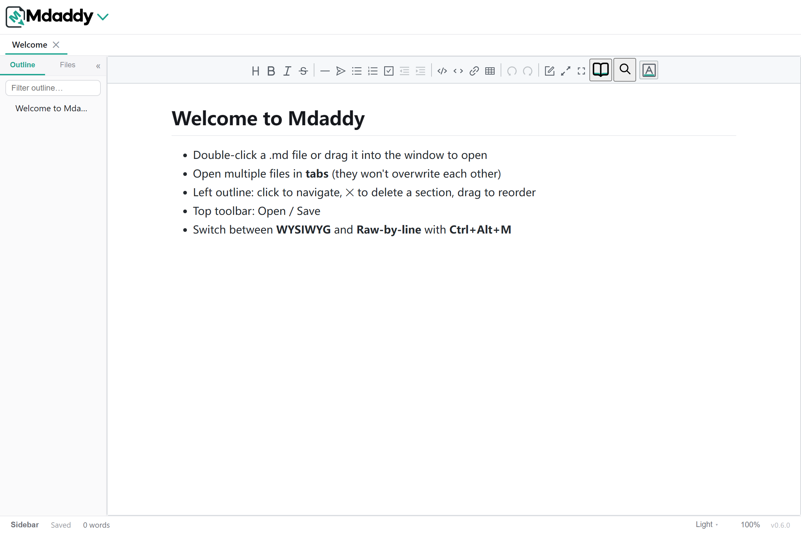

<p align="center">
  
</p>

<p align="center">
  A focused Markdown editor for Windows, with visual editing and direct access to the source.
</p>

<p align="center">
  
</p>

## Features

- Edit Markdown in a visual editor or switch to raw-by-line mode with <kbd>Ctrl</kbd>+<kbd>Alt</kbd>+<kbd>M</kbd>.
- Navigate long documents with the outline and open several files in tabs.
- Browse folders, search for Markdown files, and keep favorite folders close at hand.
- Paste images and choose how to store them, then resize them in the editor.
- Choose a light, dark, eye-care, or warm-paper appearance.
- Use keyboard shortcuts, undo, and export tools while keeping your Markdown files on your computer.

## Download

Check the [GitHub Releases](https://github.com/NinjaKristo/Mdaddy/releases) page for Windows builds. The application is distributed as a standalone `Mdaddy.exe`.

## Build from source

Requirements: Windows 10 or 11, Node.js, Rust, and the Microsoft C++ Build Tools required by Tauri.

```powershell
npm install
npm run tauri build
```

The packaged Windows executable is produced under `src-tauri/target/release/`. The project build workflow can also update `release/Mdaddy.exe` for local testing.

## License

Mdaddy is distributed under the MIT License. See [LICENSE](LICENSE) for the license and copyright notice.
